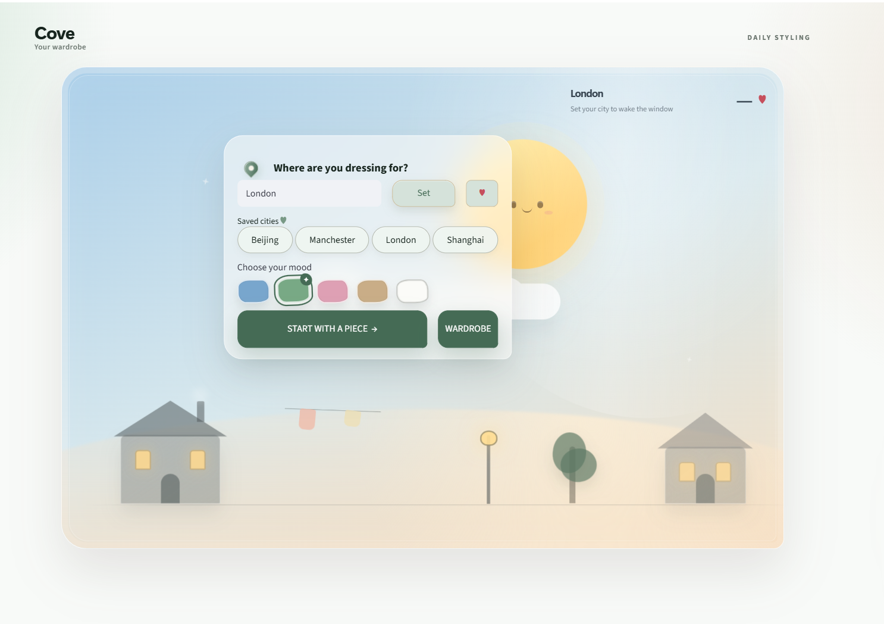
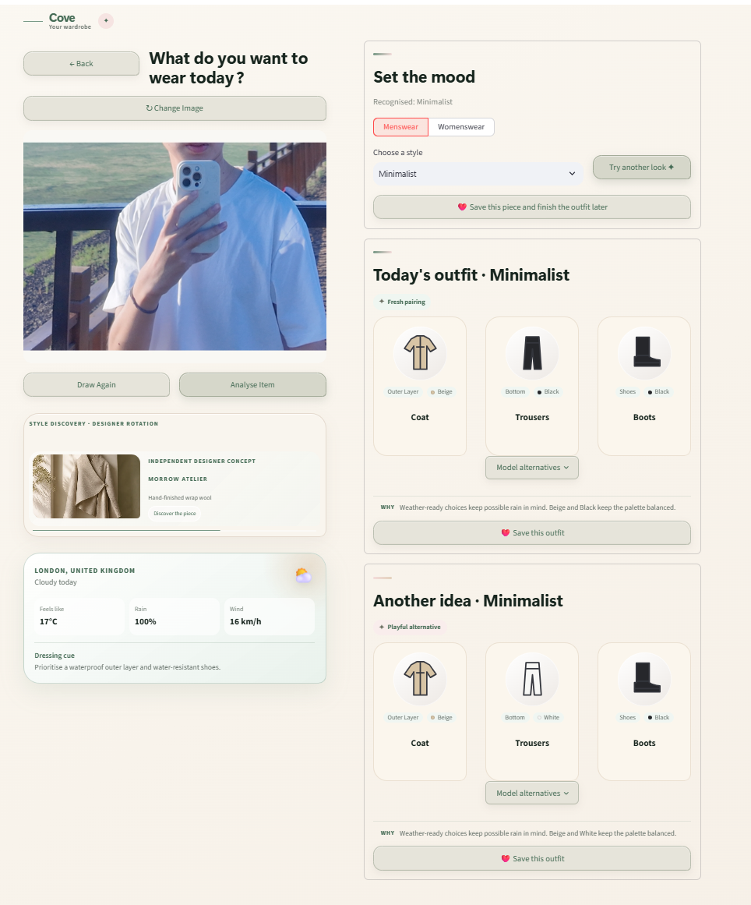

# Cove — Context-aware AI outfit recommendation

Cove is an end-to-end AI outfit recommendation prototype developed for an MSc
Applied Artificial Intelligence dissertation. Instead of beginning with a
retailer catalogue, Cove begins with a garment the user already owns. It keeps
that piece fixed, recognises its visual properties and recommends the remaining
parts of a complete outfit according to weather, style, colour mood and the
user-selected menswear or womenswear range.

The project combines computer vision, a learned garment-compatibility model,
constrained candidate search and a local wardrobe in one working Streamlit
application.



## Product highlights

- **Start with something you own.** Upload or draw around an existing garment,
  then build the rest of the outfit around it.
- **Context-aware recommendations.** Weather conditions, style, colour mood and
  clothing range become explicit constraints rather than hidden assumptions.
- **Brand-independent output.** Recommendations use 1,670 abstract garment
  concepts instead of tying the user to one retailer. The same representation
  could later connect to participating retailers or independent designers.
- **Complete outfits and alternatives.** Cove ranks four logical positions:
  inner top, outer layer, bottom and shoes, including an explicit no-outer-layer
  state for warm conditions.
- **Private local wardrobe.** Garments and outfits can be saved, renamed,
  grouped, reused and deleted locally; wardrobe images are not sent to the
  weather service.
- **Resilient behaviour.** If trained model artefacts are unavailable, a
  deterministic rules-based fallback keeps the application usable and records
  the reason.



## Technical contribution

Garment images are represented by a frozen 768-dimensional SigLIP encoder. A
project-specific 379,265-parameter compatibility head combines:

1. a masked global outfit summary;
2. learned clothing-position information; and
3. six absolute pairwise garment-difference vectors.

This design keeps downstream training small while explicitly modelling the
relationships between garments. The term *lightweight* refers to this trainable
head and its downstream training cost, not to the original pretraining cost of
SigLIP.

The compatibility score is used by an exact constrained search over abstract
garment candidates. Feasibility rules remain separate from model ranking, which
makes weather constraints, fixed garments and candidate availability easier to
inspect and test.

```text
Uploaded garment
       |
SigLIP recognition and frozen visual embedding
       |
Weather, style, colour and clothing-range constraints
       |
Relational compatibility scoring
       |
Exact search over abstract garment combinations
       |
Primary outfit + alternative + optional local save
```

## Evaluation results

The final model was evaluated on held-out secondary data with controlled
baselines, three predefined random seeds, bootstrap confidence intervals,
calibration, ablation and overfitting checks.

| Measure | Result |
|---|---:|
| Held-out test ROC-AUC | **0.8583** |
| Test accuracy | **76.64%** |
| Test F1 | **78.66%** |
| Official four-choice FITB accuracy | **60.25%** |
| FITB chance level | 25.00% |
| Three-seed mean AUC | **0.8596** |
| Three-seed AUC standard deviation | **0.0009** |
| FITB loss without pairwise module | **10.28 percentage points** |

Under the shared experimental protocol, the proposed architecture exceeded the
controlled BiLSTM, type-aware pairwise and Set Transformer adaptations by
0.0634–0.0801 AUC. Removing the pairwise module produced the clearest structural
result, supporting explicit garment-to-garment interaction as the main model
contribution.

The product-independent candidate space contains 1,670 concepts across 23
garment types, 12 colours and nine styles. In the bounded search experiment,
exact search returned deterministic top-ten results with a median CPU runtime
of 0.474 seconds. All 36 tested weather-style combinations retained the four
logical outfit positions.

## Installation

Python 3.12 is recommended.

### Windows PowerShell

```powershell
py -3.12 -m venv .venv
.\.venv\Scripts\python.exe -m pip install --upgrade pip
.\.venv\Scripts\python.exe -m pip install -r requirements-reproducible.txt
```

`requirements-reproducible.txt` contains the pinned direct dependencies used
for final verification. `requirements.txt` is the less restrictive development
list.

## Run Cove

```powershell
.\.venv\Scripts\streamlit.exe run app.py
```

The trained checkpoints and downloaded image datasets are intentionally not
stored in Git. A clean clone runs through the documented deterministic fallback.
To reproduce the trained path, follow
[`recommendation_training/README.md`](recommendation_training/README.md).

## Verification

Run the same checks used by GitHub Actions:

```powershell
.\.venv\Scripts\python.exe -m unittest discover -s tests -v
.\.venv\Scripts\python.exe -m compileall -q app.py release_check.py src recommendation_training tests
.\.venv\Scripts\python.exe -m recommendation_training.smoke_test
.\.venv\Scripts\python.exe release_check.py
```

Use `release_check.py --strict-artifacts` only when the local trained checkpoint
and abstract prototype catalogue are expected to be present.

## Repository guide

- `app.py` — Streamlit application entry point.
- `src/` — recognition, recommendation, weather and wardrobe logic.
- `recommendation_training/` — data preparation, model training and evaluation.
- `tests/` — deterministic unit and integration-level tests.
- `results/` — compact, versioned experimental evidence.
- `dissertation/` — LaTeX dissertation source, figures and appendices.
- `output/pdf/` — final dissertation and bilingual review PDF.
- `output/latex/` — portable LaTeX/Overleaf source package.

## Responsible-use boundary

Cove models compatibility patterns in the processed Polyvore data; it does not
define universal fashion quality or infer gender identity. The clothing range
is selected by the user. The official FITB result covers the subset compatible
with the four supported positions, and no participant usability study was
conducted. Dataset coverage, sparse menswear evidence and catalogue-domain
shift are documented in the dissertation and
[`MODEL_CARD.md`](recommendation_training/MODEL_CARD.md).

User preferences, wardrobe metadata and wardrobe images are excluded from Git
through `.gitignore`. The user retains control over every recommendation and can
replace, omit or delete saved pieces.

## Dissertation artefacts

- [Final dissertation PDF](output/pdf/Junyuan_Yao_Dissertation_Submission_2026-09-02.pdf)
- [LaTeX/Overleaf source package](output/latex/Junyuan_Yao_Dissertation_LaTeX_Source_2026-09-02.zip)
- [Revision and ethics audit records](dissertation/revision_records/)
